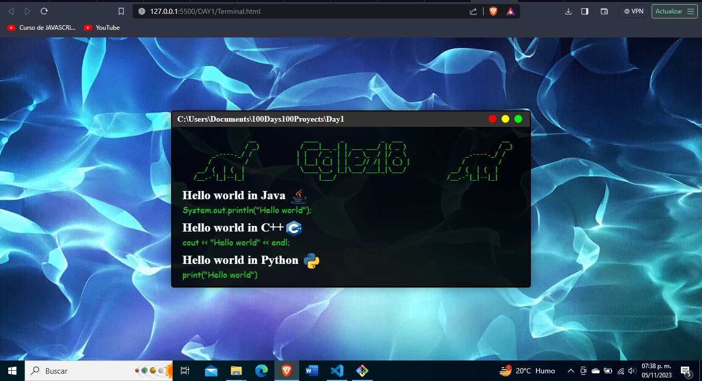

# DIA 1

## Introduccion

Vamos a crear una página web donde coloquemos el famoso "Hola mundo" en 3 distintos lenguajes de programación agregando un poco de diseño

## Imagen 

## Tecnologias usadas
* HTML
* CSS

### Authors

- [@Cglez18](https://github.com/Cglez18)